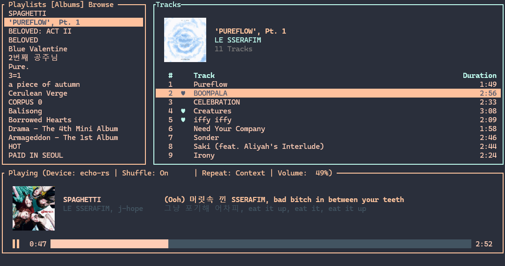

# echo

echo is a terminal-based Spotify client written in Rust. echo brings your entire Spotify library, liked songs, playlists, and playback controls directly to your terminal with a beautiful, dynamic TUI featuring native image rendering.



## Features

- **Terminal Image Support**: Renders high-quality album art and playlist covers directly in your terminal (supports Kitty, Sixel, and block fallbacks).
- **Blazing Fast Liked Songs**: Uses a global caching architecture. Your entire Liked Songs library is cached locally (`~/.config/echo/cache.json`) for zero-latency, rate-limit-free scrolling, even with thousands of saved tracks.
- **Library Management**: Create, rename, delete, and organize playlists into folders.
- **Responsive Playback Controls**: Full control over playback, queue, shuffle, repeat, and volume.
- **Search**: Fast global search for tracks and albums.

## Setup

1. **Spotify Premium**: A Spotify Premium account is required to use the Spotify Web API for playback control.
2. **Spotify Developer App**: 
   - Go to the [Spotify Developer Dashboard](https://developer.spotify.com/dashboard/).
   - Create an app and get your `Client ID` and `Client Secret`.
   - Add `http://127.0.0.1:8888/callback` to your app's Redirect URIs.
   - Echo also uses `http://127.0.0.1:8989/login` for its internal first-party Spotify session.

### Installation

Download and run installer:
https://github.com/and2049/echo/releases

Or

Clone the repository and build using Cargo:

```bash
git clone https://github.com/and2049/echo.git
cd echo
cargo build --release
```

Run the binary:

```bash
./target/release/echo
```

On first run, echo will prompt you to enter your `Client ID` and `Client Secret`, then open your browser to authenticate with Spotify.

## Navigation & Keybindings

echo is heavily keyboard-driven. 

### Global Navigation
- `j` / `k` or `Down` / `Up`: Move down / up
- `Enter` or `z`: Select item / Open playlist / Play track
- `h` / `q` / `Esc` / `Backspace`: Go back / Close modal / Clear search
- `Tab`: Switch tabs (e.g., Playlists ↔ Albums, Search Tracks ↔ Search Albums)
- `:`: Enter Command Mode
- `/`: Search within tracklist
- `f`: Global search
- `n` / `N`: Jump to next / previous search match within a list

### Playback Controls
- `Space`: Play / Pause
- `]` / `>`: Next Track
- `[` / `<`: Previous Track
- `s`: Toggle Shuffle
- `r`: Toggle Repeat Mode (Off → Track → Context)
- `=` / `-`: Volume Up / Down (by 1%)
- `+` / `_`: Volume Up / Down (by 5%)
- `D` (Shift + d): Open Device Selection menu
- `L` (Shift + l): Toggle full-screen Synced Lyrics modal
- `Ctrl + Shift + L`: Toggle condensed Synced Lyrics view

### Track & Library Actions
- `l`: Like / Unlike the selected track
- `A` (Shift + a): Jump to the Album of the selected track
- `p`: paste a cut playlist into a folder
- `a`: Add selected track to playlist / Add selected album to library
- `q`: Add currently hovered track to Queue
- `Q` (Shift + q): Open Queue view
- `m`: Pin / Unpin a playlist
- `c`: Quick shortcut to create a new playlist
- `e`: Quick shortcut to rename a playlist or folder
- `v`: Enter Visual mode for multi-selection
- `d` (double press): Delete playlist/folder, or remove a track from your custom playlist
- `x`: Cut playlist (to move into a folder)
- `R` (Shift + r): Force refresh

## Commands
While in Command Mode (`:`), you can use the following:
- `:search <query>`: Search for tracks or albums.
- `:newplaylist <name>`: Create a new playlist.
- `:newfolder <name>`: Create a new folder to organize playlists.
- `:delfolder`: Delete the currently selected folder.
- `:rename <name>`: Rename the currently selected playlist or folder.
- `:sort <alpha|creator>`: Sort your library.
- `:theme <theme_name>`: Switch application theme.
- `:lang <en|zh|zh-CN>`: Switch language.
- `:album`: Jump to the album of the currently selected track.
- `:queue`: Open the Queue view.
- `:vis`: Toggle the audio visualizer.
- `:visbins <number>`: Set the number of audio visualizer frequency bins (5-32).
- `:pixelate <pixels>`: Enable retro 8-bit aesthetic on album covers. Set to 0 to disable, or e.g., 16 for a pixelated look.
- `:index <number>`: Set track index base (1-indexed vs 0-indexed).
- `:quit`, `:q`, `:qa`, `:wq`: Exit the application.

## Troubleshooting

- **Images not rendering**: Ensure your terminal supports the Kitty image protocol or Sixel graphics (e.g., Kitty, WezTerm, Alacritty with patches). echo will fall back to block rendering if neither is supported.
- **Cache desync**: If your Liked Songs are out of sync with other devices, simply restart echo. It eagerly syncs your library in the background on startup.
- **Configuration Path**: `~/.config/echo/config.toml` (holds tokens and preferences) and `~/.config/echo/cache.json` (holds liked tracks).
