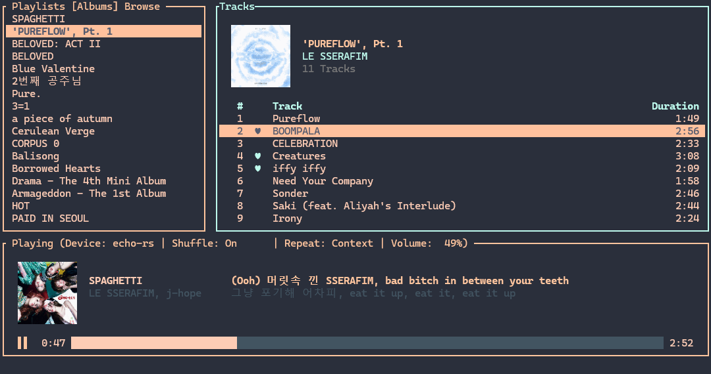

<p align="center">
    <a href="">
      <picture>
        
      </picture>
    </a>
</p>
<p align="center">
    <a href="README.md">English</a> |
    <a href="README.zh.md">简体中文</a> |
    <a href="README.zht.md">繁體中文</a>
</p>

echo is a terminal-based music player and Spotify client written in Rust. echo brings your local files and entire Spotify library, liked songs, playlists, and playback controls directly to your terminal with a beautiful, dynamic TUI featuring native image rendering.



## Features

- **Terminal Image Support**: Renders high-quality album art and playlist covers directly in your terminal (supports Kitty, Sixel, and block fallbacks).
- **Blazing Fast Liked Songs**: Uses a global caching architecture. Your entire Liked Songs library is cached locally (`~/.config/echo/cache.json`) for zero-latency, rate-limit-free scrolling, even with thousands of saved tracks.
- **Library Management**: Create, rename, delete, and organize playlists into folders.
- **Local Music Support**: Scan a local music folder, play local files, and create local playlists that can also reference Spotify tracks.
- **Responsive Playback Controls**: Full control over playback, queue, shuffle, repeat, and volume.
- **Search**: Fast global search for Spotify catalog items and scanned local tracks.

## Setup

1. **Spotify Premium**: A Spotify Premium account is required to use the Spotify Web API for playback control.
2. **Spotify Developer App**: 
   - Go to the [Spotify Developer Dashboard](https://developer.spotify.com/dashboard/).
   - Create an app and get your `Client ID` and `Client Secret`.
   - Add `http://127.0.0.1:8888/callback` to your app's Redirect URIs.
   - echo also uses `http://127.0.0.1:8989/login` for its internal first-party Spotify session.

### Installation

Download the installer for your platform from the [releases page](https://github.com/and2049/echo/releases). Each **echo** package installs the desktop app *and* the `spotify` terminal command:

- **Windows** (`echo-desktop_*.msi`): installs the desktop app and adds the install directory to `PATH`, so `spotify` works from any shell after install (open a new terminal). Uninstalling removes the `PATH` entry again.
- **macOS** (`echo_*.dmg`): drag `echo.app` to Applications. The TUI ships inside the bundle; to put it on `PATH`, link it once:

  ```bash
  sudo ln -sf /Applications/echo.app/Contents/MacOS/spotify /usr/local/bin/spotify
  ```

- **Linux** (`.deb`): installs the desktop app plus `/usr/bin/spotify`. Prefer just the TUI? Use the TUI AppImage below (`spotify_*.AppImage`) instead — don't install both, they'd both own `spotify`.

### TUI AppImage Setup (Linux)

On Ubuntu 22.04+ the AppImage runtime requires `libfuse2`:

```bash
sudo apt-get install libfuse2
```

**Install with one command** (downloads the latest AppImage and sets up desktop integration):

```bash
curl -fsSL https://github.com/and2049/echo/releases/latest/download/install.sh | sh
```

To uninstall:

```bash
curl -fsSL https://github.com/and2049/echo/releases/latest/download/install.sh | sh -s -- --uninstall
```

**Or** if you already have the AppImage downloaded, run the included install script:

```bash
./install.sh /path/to/echo.AppImage
```

To remove:

```bash
./install.sh --uninstall
```

### Build from Source

Clone the repository and build using Cargo:

**Linux dependencies** (Ubuntu/Debian):

```bash
sudo apt-get install -y --no-install-recommends \
  libasound2-dev libdbus-1-dev pkg-config libssl-dev
```

```bash
git clone https://github.com/and2049/echo.git
cd echo
cargo build --release
```

Run the binary:

```bash
./target/release/spotify
```

> The terminal command is `spotify` — the previous name collided with the shell builtin `echo`. Configuration and caches still live in `~/.config/echo/`, so existing setups keep working after the rename. On Windows, if the official Spotify client's directory happens to be on your `PATH`, make sure `%USERPROFILE%\.cargo\bin` (or wherever you installed this binary) comes first.

On first run, echo will prompt you to enter your `Client ID` and `Client Secret`, then open your browser to authenticate with Spotify.

## Navigation & Keybindings

echo is heavily keyboard-driven. 

### Global Navigation
- `j` / `k` or `Down` / `Up`: Move down / up
- `gg` / `G`: Jump to the first / last item
- `Ctrl-b` / `Ctrl-f` or `Page Up` / `Page Down`: Move one page
- `Ctrl-u` / `Ctrl-d`: Move half a page
- `Ctrl-l`: Clear and fully redraw the TUI
- `gc`: Jump to the currently playing track or its available context
- `Enter` or `z`: Select item / Open playlist / Play track
- `h` / `q` / `Esc` / `Backspace`: Go back / Close modal / Clear search
- `Tab`: Switch tabs (e.g., Playlists ↔ Albums, Search Tracks ↔ Search Albums)
- `:`: Enter Command Mode
- `/`: Search within tracklist
- `f`: Global search
- `n` / `N`: Jump to next / previous search match within a list

### Playback Controls
- `Space`: Play / Pause
- `]` / `>`: Next Track
- `[` / `<`: Previous Track
- `,` / `.`: Seek backward / forward by 5 seconds
- `0`: Seek to the start of the current track
- `M` (Shift + m): Mute / restore the previous volume
- `s`: Toggle Shuffle
- `r`: Toggle Repeat Mode (Off → Track → Context)
- `=` / `-`: Volume Up / Down (by 1%)
- `+` / `_`: Volume Up / Down (by 5%)
- `D` (Shift + d): Open Device Selection menu
- `L` (Shift + l): Toggle full-screen Synced Lyrics modal
- `Ctrl + Shift + L`: Toggle condensed Synced Lyrics view

### Track & Library Actions
- `l`: Like / Unlike the selected track
- `A` (Shift + a): Open action menu for hovered track (or currently playing if not focused in track page)
- `p`: paste a cut playlist into a folder
- `a`: Add selected track to playlist / Add selected album to library
- `q`: Add currently hovered track to Queue
- `Q` (Shift + q): Open Queue view
- `m`: Pin / Unpin a playlist
- `T` (Shift + t): Toggle library thumbnails (cover art next to playlist / album names)
- `c`: Quick shortcut to create a new playlist
- `e`: Quick shortcut to rename a playlist or folder
- `v`: Enter Visual mode for multi-selection
- `d` (double press): Delete playlist/folder, or remove a track from your custom playlist
- `x`: Cut playlist (to move into a folder)
- `R` (Shift + r): Force refresh

The track action menu adapts to the source. Spotify tracks support link copying, liking, and album library actions. Local tracks support copying their absolute path and revealing the file in the platform file manager. Both sources retain album/artist navigation, playlist insertion, and queue actions where applicable.

## Commands
While in Command Mode (`:`), you can use the following:
- `:search <query>`: Search for tracks or albums.
- `:newplaylist <name>`: Create a new playlist.
- `:newlocalplaylist <name>`: Create a local playlist stored on this machine.
- `:localpath <absolute-folder-path>`: Set the local music folder and scan it. The path must be absolute and works on macOS, Windows, and Linux.
- `:rescanlocal`: Rescan the configured local music folder.
- `:newfolder <name>`: Create a new folder to organize playlists.
- `:delfolder`: Delete the currently selected folder.
- `:rename <name>`: Rename the currently selected playlist or folder.
- `:sort <alpha|creator>`: Sort the playlist library.
- `:sort <original|title|artist|album|duration|added|reverse>`: Sort the active track list entirely in memory.
- `:seek <seconds|+seconds|-seconds>`: Seek to an absolute position or by a relative offset.
- `:mute`: Mute playback or restore the previous volume.
- `:open [spotify-url-or-uri]`: Open a Spotify track, album, artist, or playlist. With no argument, read it from the clipboard.
- `:relative <on|off|toggle>`: Configure Vim-style relative line numbers in track lists.
- `:redraw`: Clear and fully redraw the TUI after unexpected terminal output.
- `:theme <theme_name>`: Switch application theme.
- `:lang <en|zh|zh-CN>`: Switch language.
- `:album`: Jump to the album of the currently selected track.
- `:queue`: Open the Queue view.
- `:vis`: Toggle the audio visualizer.
- `:visbins <number>`: Set the number of audio visualizer frequency bins (5-32).
- `:pixelate <pixels>`: Enable retro 8-bit aesthetic on album covers. Set to 0 to disable, or e.g., 16 for a pixelated look.
- `:thumbs [on|off]`: Toggle cover-art thumbnails in the library sidebar. Covers are cached in `~/.config/echo/thumbs/` so they load instantly on later launches.
- `:index <number>`: Set track index base (1-indexed vs 0-indexed).
- `:quit`, `:q`, `:qa`, `:wq`: Exit the application.

## Custom Keybindings

Add a `keybindings` table under `[library]` in `~/.config/echo/config.toml` to override or add semantic mappings. Single keys, modifier keys such as `ctrl-f`, and two-key sequences are supported. Unmapped keys keep echo's defaults.

```toml
[library.keybindings]
"s d" = "sort_duration"
"s a" = "sort_artist"
"ctrl-j" = "half_page_down"
"ctrl-k" = "half_page_up"
";" = "seek_forward"
```

Available actions are `first`, `last`, `page_up`, `page_down`, `half_page_up`, `half_page_down`, `current_context`, `play_pause`, `next`, `previous`, `shuffle`, `repeat`, `seek_backward`, `seek_forward`, `seek_start`, `mute`, `sort_original`, `sort_title`, `sort_artist`, `sort_album`, `sort_duration`, `sort_added`, `reverse_tracks`, `redraw`, and `toggle_thumbnails`.

Track sorting and navigation operate on already-loaded data. They do not issue Spotify requests. Navigation history retains up to 20 in-memory views so returning to a previous track list normally does not refetch it.

## Audio Quality

echo streams at 320 kbps and applies volume normalisation, matching the Spotify desktop app's defaults. These live under `[library]` in `~/.config/echo/config.toml` and take effect on the next launch.

```toml
[library]
bitrate = 320               # 96, 160, or 320
normalisation = true        # Even out loudness between tracks, like the Spotify app.
normalisation_pregain = 3.0 # dB added back after normalisation. Raise if playback is too quiet.
```

Normalisation attenuates each track by its ReplayGain value, which is typically several dB on modern masters. `normalisation_pregain` adds that headroom back so playback lands at a comparable level to the Spotify app. The gain is applied ahead of librespot's dynamic limiter, so raising it does not clip. Setting `normalisation = false` skips the gain stage entirely for bit-exact full-scale output, at the cost of loudness jumps between tracks.

Volume is applied entirely client-side — Spotify streams arrive at full scale, and echo attenuates them itself, so the device's volume slider in other Spotify clients is inactive. Both Spotify and local playback use the same cubic volume curve, so a given percentage sounds the same whichever source is playing, and 100% is unity gain on both.

echo opens the output device as stereo at 44.1 kHz — librespot's native rate, so no resampling — whenever the device supports it. Devices that do not offer 44.1 kHz (most Windows endpoints default to 48 kHz) fall back to the device's own default rate.

The endpoint actually opened is written to `echo-debug-audio-spotify.log` in the working directory, and `echo-debug-audio-local.log` for local files:

```
device=Headphones (WH-1000XM5) channels=2 sample_rate=48000 format=F32
```

## Local Music

Local support is separate from Spotify. Use `:localpath <absolute-folder-path>` to choose the folder echo should scan. Supported audio extensions are `mp3`, `wav`, `flac`, `ogg`, `m4a`, and `aac`; echo scans recursively and reads title, artist, album, duration, and artwork when available. echo refreshes the configured local folder on startup and watches it for supported audio/artwork changes while running; `:rescanlocal` is still available as a manual fallback.

Local playlists are stored locally and are not Spotify playlists. They can contain local tracks and Spotify track references. Spotify playlists cannot contain local tracks. Local shuffle, repeat, volume, queue, and play/pause are handled by echo's local playback engine.

Embedded artwork is used when available. If a track has no embedded artwork, echo looks for folder artwork such as `cover.jpg`, `folder.jpg`, or `front.png`.

## Troubleshooting
- **Theme color rendering issues (Windows)**: Disable "Adjust indistinguishable text" in the Appearance settings of the Defaults profile. 
- **Images not rendering**: Cover art is drawn with half-block cells and needs nothing from the terminal beyond truecolor support, which every modern terminal has.
- **Cache desync**: If your Liked Songs are out of sync with other devices, simply restart echo. It eagerly syncs your library in the background on startup.
- **Local file missing**: If a file was deleted or moved after scanning, run `:rescanlocal` to refresh the local library.
- **Audio sounds mono or muffled (Bluetooth headsets)**: Windows exposes a Bluetooth headset as two output devices — a stereo "Headphones" (A2DP) endpoint, and a mono "Hands-Free" (HFP) endpoint capped at 16 kHz. Windows switches to Hands-Free whenever an application opens the microphone. Check `echo-debug-audio-spotify.log`: if it reports `channels=1`, quit whatever is holding the mic and select the stereo endpoint as your default output device.
- **Configuration Path**: `~/.config/echo/config.toml` (holds tokens and preferences), `~/.config/echo/cache.json` (holds liked tracks), `~/.config/echo/local_library.json`, and `~/.config/echo/local_playlists.json`.
