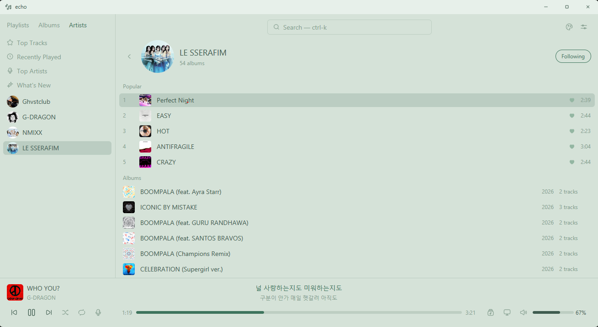

<p align="center">
    <a href="">
      <picture>
        
      </picture>
    </a>
</p>
<p align="center">
    <a href="README.md">English</a> |
    <a href="README.zh.md">简体中文</a> |
    <a href="README.zht.md">繁體中文</a>
</p>

echo 是一款用 Rust 编写的原生桌面音乐播放器和 Spotify 客户端。echo 将您的整个 Spotify 库——喜欢的歌曲、播放列表、专辑以及关注的艺术家——加上本地音乐文件汇集到一个快速、键盘友好的应用中，提供完整的播放控制、同步歌词和动态主题。同一安装包还附带一个终端客户端（`spotify`），在您想待在终端里时随时可用。



## 功能特性

- **原生桌面应用**：基于 GPUI（Zed 的 UI 框架）构建，界面快速且由 GPU 加速，可在 Windows、macOS 和 Linux 上运行。既可以用鼠标操作，也可以完全用键盘驱动。
- **完整的资料库**：一个侧栏收纳播放列表、专辑和关注的艺术家，并支持热门曲目、最近播放和热门艺术家视图。
- **全面的播放控制**：在正在播放栏中即可播放/暂停、上一曲/下一曲、跳转进度、随机播放、重复、音量、队列和设备切换。
- **同步歌词**：时间同步的歌词可直接显示在播放栏中，或以全屏视图呈现。
- **最新动态**：来自您关注艺术家的近期专辑与单曲信息流，最多每 6 小时刷新一次。
- **极速喜欢的歌曲**：您整个喜欢的歌曲库会缓存在本地（`~/.config/echo/cache.json`），实现零延迟、无速率限制的滚动浏览，即使有数千首保存的曲目也毫无压力。
- **库管理**：创建、重命名、删除播放列表并将其组织到文件夹中；在自己的播放列表中重新排列曲目顺序。
- **本地音乐支持**：扫描本地音乐文件夹，播放本地文件，创建也可引用 Spotify 曲目的本地播放列表。
- **搜索**：快速全局搜索（`ctrl-k`），覆盖 Spotify 目录和已扫描的本地曲目。
- **动态主题**：内置多套主题，并支持实时主题编辑——参见[主题](#主题)。
- **终端客户端**：同一安装也会将功能完备的 `spotify` TUI 加入您的 `PATH`——参见[终端客户端 (TUI)](#终端客户端-tui)。

## 设置

1. **Spotify Premium**：需要使用 Spotify Premium 账户才能通过 Spotify Web API 进行播放控制。
2. **Spotify 开发者应用**：
   - 前往 [Spotify 开发者仪表盘](https://developer.spotify.com/dashboard/)。
   - 创建一个应用并获取您的 `Client ID` 和 `Client Secret`。
   - 将 `http://127.0.0.1:8888/callback` 添加到应用的 Redirect URIs 中。
   - echo 还使用 `http://127.0.0.1:8989/login` 进行内部第一方 Spotify 会话。

### 安装

一条命令即可完成安装：桌面应用**与** `spotify` 终端命令。

**Linux 与 macOS**

```bash
curl -fsSL https://github.com/and2049/echo/releases/latest/download/install.sh | sh
```

**Windows**（PowerShell）

```powershell
irm https://github.com/and2049/echo/releases/latest/download/install.ps1 | iex
```

两者均无需管理员权限，都会将 `spotify` 加入 `PATH`（安装后请打开新终端），并把桌面应用添加到开始菜单、启动台或应用程序菜单中。

| 平台 | 安装位置 |
| --- | --- |
| Windows | `%LOCALAPPDATA%\Programs\echo`（通过发布的 MSI 安装，x64） |
| macOS | `/Applications/echo.app`，并将 `spotify` 链接到 `~/.local/bin`（Apple Silicon） |
| Linux | `~/.local/share/echo`，并将两个命令链接到 `~/.local/bin`（x86_64） |

指定版本或卸载：

```bash
curl -fsSL https://github.com/and2049/echo/releases/latest/download/install.sh | sh -s -- --version 0.4.6
curl -fsSL https://github.com/and2049/echo/releases/latest/download/install.sh | sh -s -- --uninstall
```

```powershell
& ([scriptblock]::Create((irm https://github.com/and2049/echo/releases/latest/download/install.ps1))) -Version 0.4.6
& ([scriptblock]::Create((irm https://github.com/and2049/echo/releases/latest/download/install.ps1))) -Uninstall
```

卸载不会删除 `~/.config/echo` 中的配置。

在 Linux 上，桌面应用依赖若干系统库——Debian/Ubuntu 下：

```bash
sudo apt-get install libasound2 libdbus-1-3 libssl3 \
  libfontconfig1 libxkbcommon0 libxkbcommon-x11-0 libwayland-client0 libx11-xcb1
```

桌面环境通常已经带有其中大部分。渲染优先使用 Vulkan，并可回退到 OpenGL，因此
`libvulkan1` 与显卡驱动值得安装，但并非必需。

#### 更新

首次安装之后，echo 可自我更新——无需重装，也无需管理员权限：

```bash
spotify upgrade          # 更新到最新版本
spotify upgrade --check  # 仅检查是否有可用更新
spotify upgrade 0.4.6    # 更新到指定版本
```

桌面应用也可通过**设置 → 更新 → 检查更新**完成同样操作。两者都会就地替换二进制文件与内置主题，并提示重启。

### 从源码构建

克隆仓库并使用 Cargo 构建：

**Linux 依赖**（Ubuntu/Debian）：

```bash
sudo apt-get install -y --no-install-recommends \
  libasound2-dev libdbus-1-dev pkg-config libssl-dev \
  libfontconfig-dev libwayland-dev libx11-xcb-dev libxkbcommon-x11-dev
```

```bash
git clone https://github.com/and2049/echo.git
cd echo
cargo build --release -p echo-desktop -p spotify-tui
```

运行桌面应用或终端客户端：

```bash
./target/release/echo-desktop   # 桌面应用
./target/release/spotify        # 终端客户端
```

裸的 `cargo build --release`（或 `cargo run`）只构建 `spotify` 终端客户端——它是工作区的默认成员——因此要构建桌面应用请额外指定 `-p echo-desktop`。

> 终端命令名为 `spotify`——之前的名字与 shell 内建命令 `echo` 冲突。配置和缓存仍位于 `~/.config/echo/`，因此现有环境在重命名后可继续使用。在 Windows 上，如果官方 Spotify 客户端的目录恰好在您的 `PATH` 中，请确保 `%USERPROFILE%\.cargo\bin`（或您安装此二进制文件的位置）排在前面。

首次运行时，echo 会提示您输入 `Client ID` 和 `Client Secret`，然后打开浏览器以通过 Spotify 进行身份验证。

## 桌面应用

桌面应用支持鼠标操作——点击播放列表、艺术家或曲目即可打开，使用正在播放栏中的控件，还可拖动曲目来重排自己的播放列表。它也完全可以用键盘驱动。任何时候按 `?` 可查看应用内快捷键面板，按 `ctrl-,` 打开设置，按 `t` 切换主题。快捷键与下方的终端客户端一致。

**导航**：`j` / `k` / `↓` / `↑` 移动，`gg` / `G` 跳到开头 / 末尾，`ctrl-b` / `ctrl-f` 翻页，`ctrl-u` / `ctrl-d` 翻半页，`enter` / `z` 打开，`h` / `esc` 返回，`←` / `→` 在窗格间移动焦点，`tab` 切换标签页，`gc` 跳转到正在播放的曲目。

**播放**：`space` 播放/暂停，`[` / `]`（或 `ctrl-←` / `ctrl-→`）上一曲 / 下一曲，`,` / `.` 跳转进度，`-` / `=` 音量，`shift-M` 静音，`s` / `r` 随机播放 / 重复，`shift-D` 设备菜单，`shift-L` 全屏歌词，`ctrl-shift-L` 播放栏内歌词。

**库操作**：`l` 喜欢/取消喜欢，`a` 添加到播放列表，`shift-A` 曲目操作，`q` / `shift-Q` 队列，`shift-J` / `shift-K` 在自己的播放列表中移动曲目，`dd` 删除，`v` 选择范围，`m` 固定，`c` / `e` 创建 / 重命名。

**查找内容**：`ctrl-k` 全局搜索，`/` 过滤当前列表，`n` / `shift-N` 下一个 / 上一个匹配项，`:` 命令栏，`t` 主题，`?` 帮助，`ctrl-q` 退出。

`:` 命令栏接受与终端客户端相同的命令——参见[命令](#命令)。

## 终端客户端 (TUI)

同一安装还附带 `spotify`，一个功能完备的终端客户端，支持在终端中直接渲染图像。它与桌面应用共享 echo 的缓存、配置、播放引擎和命令。


- **终端图像支持**：直接在终端中呈现高品质专辑封面和播放列表封面（支持 Kitty、Sixel 以及块状回退方案）。
- **桌面应用的全部功能**：相同的资料库、搜索、本地音乐、播放控制和 `:` 命令，完全由键盘驱动。

echo 主要由键盘驱动。

### 全局导航
- `j` / `k` 或 `Down` / `Up`：向下 / 向上移动
- `gg` / `G`：跳到第一个 / 最后一个项目
- `Ctrl-b` / `Ctrl-f` 或 `Page Up` / `Page Down`：移动一页
- `Ctrl-u` / `Ctrl-d`：移动半页
- `Ctrl-l`：清除并完整重绘 TUI
- `gc`：跳转到正在播放的曲目或其可用上下文
- `Enter` 或 `z`：选择项目 / 打开播放列表 / 播放曲目
- `h` / `q` / `Esc` / `Backspace`：返回 / 关闭模态框 / 清除搜索
- `Tab`：切换标签页（例如，播放列表 ↔ 专辑，搜索曲目 ↔ 搜索专辑）
- `:`：进入命令模式
- `/`：在曲目列表中搜索
- `f`：全局搜索
- `n` / `N`：跳转到列表中的下一个 / 上一个搜索结果

### 播放控制
- `Space`：播放 / 暂停
- `]` / `>`：下一曲
- `[` / `<`：上一曲
- `,` / `.`：向后 / 向前快进 5 秒
- `0`：跳到当前曲目开头
- `M`（Shift + m）：静音 / 恢复之前的音量
- `s`：切换随机播放
- `r`：切换重复模式（关闭 → 单曲循环 → 列表循环）
- `=` / `-`：音量增大 / 减小（1%）
- `+` / `_`：音量增大 / 减小（5%）
- `D`（Shift + d）：打开设备选择菜单
- `L`（Shift + l）：切换全屏同步歌词界面
- `Ctrl + Shift + L`：切换精简同步歌词视图

### 曲目与库操作
- `l`：喜欢 / 取消喜欢所选曲目
- `A`（Shift + a）：打开悬停曲目的操作菜单（若未聚焦在曲目页面则打开当前播放曲目的菜单）
- `p`：将剪切的播放列表粘贴到文件夹中
- `a`：将所选曲目添加到播放列表 / 将所选专辑添加到库中
- `q`：将当前悬停的曲目添加到队列
- `Q`（Shift + q）：打开队列视图
- `m`：固定 / 取消固定播放列表
- `T`（Shift + t）：切换资料库封面缩略图（在播放列表 / 专辑名称旁显示封面）
- `c`：快速创建新播放列表
- `e`：快速重命名播放列表或文件夹
- `v`：进入可视模式以进行多选
- `d`（双击）：删除播放列表/文件夹，或从自定义播放列表中移除曲目
- `x`：剪切播放列表（以便移动到文件夹中）
- `J` / `K`（Shift + j / k，桌面端）：在自己播放列表中将所选曲目下移 / 上移（也支持拖拽）；需要原始排序方式
- `R`（Shift + r）：强制刷新

曲目操作菜单会根据来源自动调整。Spotify 曲目支持复制链接、喜欢和专辑入库等操作。本地曲目支持复制绝对路径和在系统文件管理器中显示文件。两种来源都保留专辑/艺术家导航、插入播放列表和加入队列等操作（如适用）。

## 命令

在命令模式（`:`）下，您可以使用以下命令：
- `:search <query>`：搜索曲目或专辑。
- `:newplaylist <name>`：创建新播放列表。
- `:newlocalplaylist <name>`：创建存储在本机的本地播放列表。
- `:localpath <absolute-folder-path>`：设置本地音乐文件夹并扫描。路径必须为绝对路径，支持 macOS、Windows 和 Linux。
- `:rescanlocal`：重新扫描已配置的本地音乐文件夹。
- `:newfolder <name>`：创建新文件夹以组织播放列表。
- `:delfolder`：删除当前选中的文件夹。
- `:rename <name>`：重命名当前选中的播放列表或文件夹。
- `:sort <alpha|creator>`：对播放列表库进行排序。
- `:sort <original|title|artist|album|duration|added|reverse>`：完全在内存中对当前曲目列表排序。
- `:seek <seconds|+seconds|-seconds>`：跳转到绝对位置或按相对偏移跳转。
- `:sleep <30m|1h|off>`：延迟后暂停播放（睡眠定时器）。
- `:mute`：静音播放或恢复之前的音量。
- `:open [spotify-url-or-uri]`：打开 Spotify 曲目、专辑、艺术家或播放列表。不带参数时从剪贴板读取。
- `:relative <on|off|toggle>`：配置曲目列表中 Vim 风格的相对行号。
- `:redraw`：在终端输出异常后清除并完整重绘 TUI。
- `:theme <theme_name>`：切换应用主题。
- `:lang <en|zh|zh-CN>`：切换语言。
- `:album`：跳转到当前选中曲目所属的专辑。
- `:queue`：打开队列视图。
- `:vis`：切换音频可视化器。
- `:visbins <number>`：设置音频可视化器频率条数量（5-32）。
- `:pixelate <pixels>`：在专辑封面上启用复古 8 位像素风格。设置为 0 可禁用，或例如 16 以获得像素化效果。
- `:thumbs [on|off]`：切换资料库侧栏中的封面缩略图。封面缓存于 `~/.config/echo/thumbs/`，之后启动时即时加载。
- `:index <number>`：设置曲目索引基数（从 1 开始或从 0 开始）。
- `:quit`、`:q`、`:qa`、`:wq`：退出应用。

## 自定义快捷键

在 `~/.config/echo/config.toml` 的 `[library]` 下添加 `keybindings` 表，可以覆盖或添加语义化映射。支持单键、修饰键组合（如 `ctrl-f`）以及两键序列。未映射的按键保留 echo 的默认行为。

```toml
[library.keybindings]
"s d" = "sort_duration"
"s a" = "sort_artist"
"ctrl-j" = "half_page_down"
"ctrl-k" = "half_page_up"
";" = "seek_forward"
```

可用动作为 `first`、`last`、`page_up`、`page_down`、`half_page_up`、`half_page_down`、`current_context`、`play_pause`、`next`、`previous`、`shuffle`、`repeat`、`seek_backward`、`seek_forward`、`seek_start`、`mute`、`sort_original`、`sort_title`、`sort_artist`、`sort_album`、`sort_duration`、`sort_added`、`reverse_tracks`、`redraw` 和 `toggle_thumbnails`。

曲目排序与导航仅作用于已加载的数据，不会向 Spotify 发送请求。导航历史最多保留 20 个内存中的视图，因此返回之前的曲目列表通常无需重新获取。

## 主题

主题位于 `themes/*.toml`，采用扁平列表格式：九个基础颜色之后是桌面应用使用的十二个派生颜色，每一项都有明确的注释说明其用途。您可以随意修改数值，或修改基础颜色后运行 `python themes/generate_desktop.py` 重新计算派生颜色。派生键是可选的——缺失的键会按其注释中命名的公式计算，同时也可以接受 `[desktop]` 表用于覆盖。要进行可视化迭代，可运行 `python tools/theme-preview/serve.py` 在浏览器中打开桌面窗口的实时模拟，每次保存都会重新着色——无需重新构建。颜色可以从任一方向编辑：在编辑器中修改 toml 文件，或在预览图例中点击任意颜色，用取色器调整并直接写回文件（其中的“重新计算派生色”按钮会为当前主题重新运行生成器）。

## 音频质量

echo 以 320 kbps 流媒体播放并应用音量归一化，与 Spotify 桌面应用的默认行为一致。这些选项位于 `~/.config/echo/config.toml` 的 `[library]` 下，并在下次启动时生效。

```toml
[library]
bitrate = 320               # 96、160 或 320
normalisation = true        # 平衡曲目之间的响度，类似 Spotify 应用。
normalisation_pregain = 3.0 # 归一化后加回的分贝数。若播放过小声请调高。
```

归一化会根据每首曲目的 ReplayGain 值进行衰减，现代母带通常有几个分贝。`normalisation_pregain` 会把这部分余量加回来，使播放音量与 Spotify 应用相当。增益作用于 librespot 的动态限制器之前，因此调高不会产生削波。设置 `normalisation = false` 可完全跳过增益环节，获得位精确的满幅输出，代价是曲目之间会出现响度跳变。

音量完全在客户端侧应用——Spotify 流以满幅到达，由 echo 自行衰减，因此在其他 Spotify 客户端中设备的音量滑块不起作用。Spotify 和本地播放使用相同的三次方音量曲线，因此无论播放哪个来源，相同的百分比听起来一样，且两者在 100% 时均为单位增益。

只要设备支持，echo 就会以立体声 44.1 kHz（librespot 的原始采样率，因此无需重采样）打开输出设备。不提供 44.1 kHz 的设备（大多数 Windows 端点默认 48 kHz）会回退到设备自身的默认采样率。

实际打开的端点会写入工作目录下的 `echo-debug-audio-spotify.log`，本地文件则写入 `echo-debug-audio-local.log`：

```
device=Headphones (WH-1000XM5) channels=2 sample_rate=48000 format=F32
```

## 本地音乐

本地音乐支持与 Spotify 分开。使用 `:localpath <absolute-folder-path>` 选择 echo 应扫描的文件夹。支持的音频扩展名为 `mp3`、`wav`、`flac`、`ogg`、`m4a` 和 `aac`；echo 会递归扫描并读取标题、艺术家、专辑、时长和封面图（如有）。echo 在启动时会刷新已配置的本地文件夹，并在运行期间监视其中的音频/封面图变化；`:rescanlocal` 仍可作为手动回退方案使用。

本地播放列表存储在本地，不是 Spotify 播放列表。它们可以包含本地曲目和 Spotify 曲目引用。Spotify 播放列表不能包含本地曲目。本地随机播放、重复、音量、队列和播放/暂停由 echo 的本地播放引擎处理。

内嵌封面图会被优先使用。如果曲目没有内嵌封面图，echo 会查找文件夹中的封面图，例如 `cover.jpg`、`folder.jpg` 或 `front.png`。

## 故障排除

- **主题颜色渲染问题 (Windows)**：在“默认值”配置文件的“外观”设置中，禁用“调整难以区分的文本”。
- **图像无法渲染**：封面使用半格单元格绘制，只需要终端支持真彩色——所有现代终端都已具备。
- **缓存不同步**：如果您喜欢的歌曲与其他设备不同步，只需重启 echo。它会在启动时在后台急切地同步您的库。
- **本地文件丢失**：如果文件在扫描后被删除或移动，运行 `:rescanlocal` 以刷新本地库。
- **音频听起来单声道或沉闷（蓝牙耳机）**：Windows 将蓝牙耳机暴露为两个输出设备——立体声的“耳机”（A2DP）端点，以及限制在 16 kHz 的单声道“免提”（HFP）端点。每当有应用程序打开麦克风时，Windows 就会切换到免提模式。检查 `echo-debug-audio-spotify.log`：如果报告 `channels=1`，请退出占用麦克风的程序，并将立体声端点设为默认输出设备。
- **配置文件路径**：`~/.config/echo/config.toml`（保存令牌和偏好设置）、`~/.config/echo/cache.json`（保存喜欢的曲目）、`~/.config/echo/local_library.json` 和 `~/.config/echo/local_playlists.json`。
